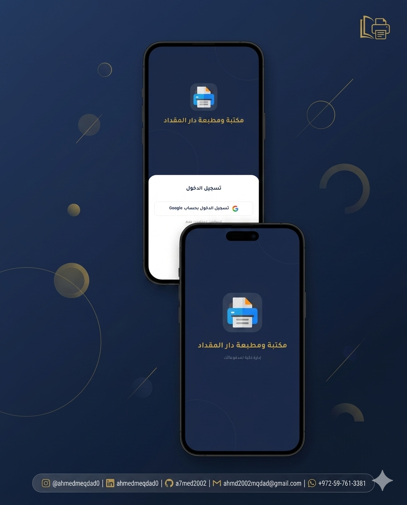
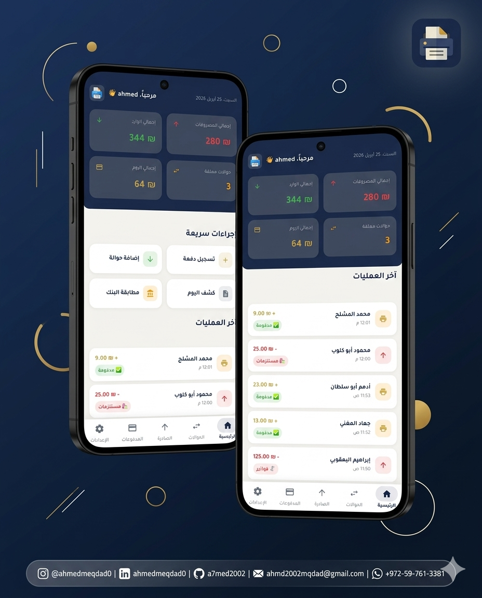
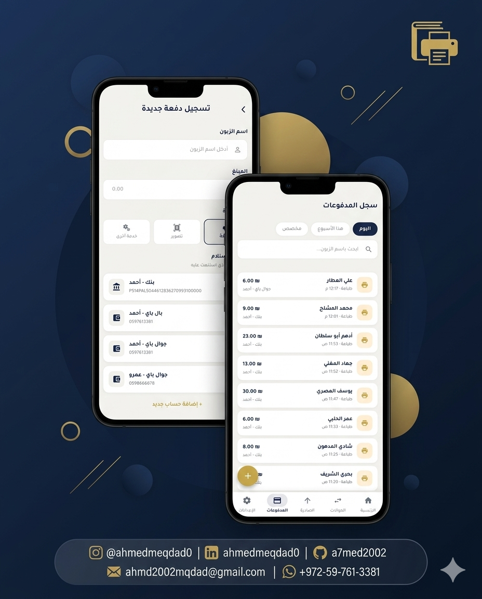
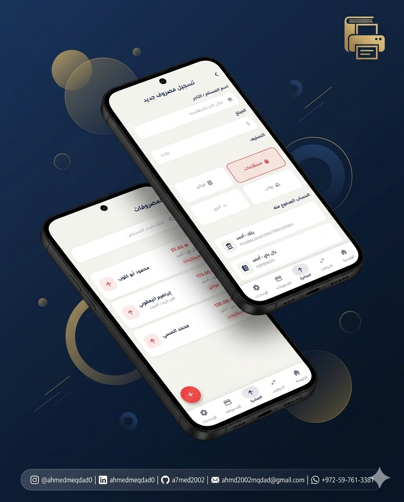
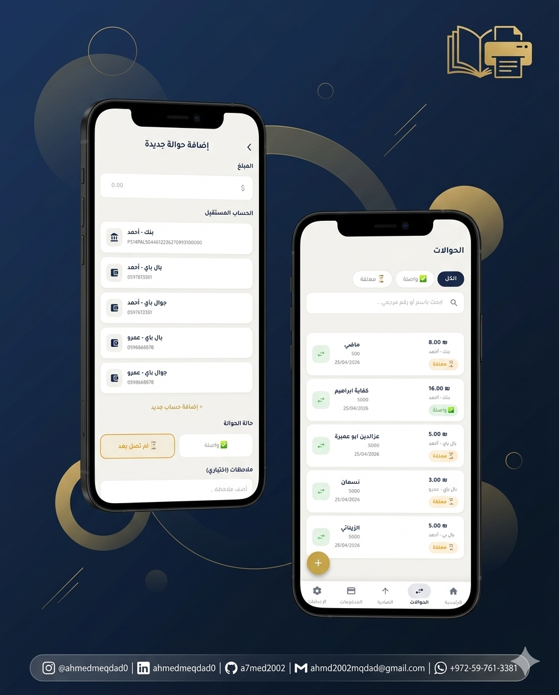
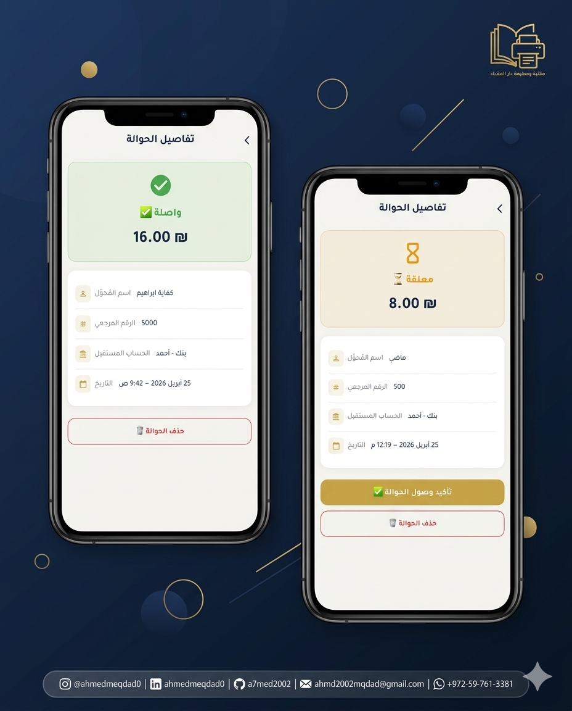
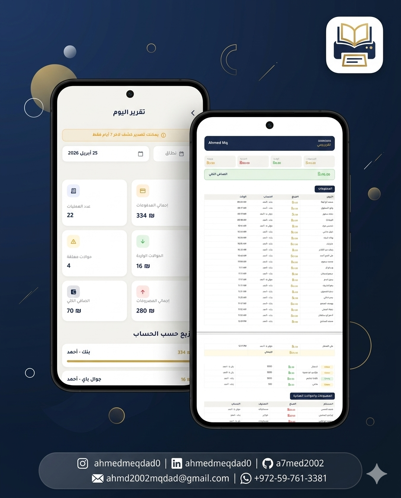
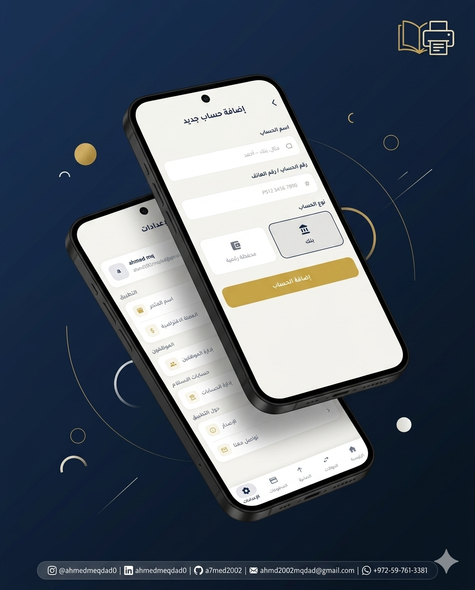

<div align="center">

# 📚 Dar Al-Miqdad Library Management System

### مكتبة ومطبعة دار المقداد — نظام إدارة متكامل

**A full-featured, Arabic-first business management app built with Flutter & Firebase**


</div>

---

## 📖 Project Overview

**Dar Al-Miqdad Library Management System** is a production-grade Flutter application built specifically for **دار المقداد** — a printing and bookstore business in Palestine. It provides a complete, real-time back-office solution for managing daily financial operations: customer payments, incoming bank transfers, outgoing expenses, PDF/Excel reporting, and bank reconciliation.

The app is designed with a native **Arabic RTL interface**, role-based access (Admin vs. Employee), real-time Firestore sync, local offline caching with ObjectBox, and push notifications via Firebase Cloud Messaging — making it a robust tool for a real operational environment, not a demo.

---

## 🛠️ Tech Stack

| Layer | Technology | Purpose |
|-------|-----------|---------|
| **Framework** | Flutter 3.x (Dart ^3.11.0) | Cross-platform mobile UI |
| **State Management** | GetX 4.7 | Reactive state, DI, routing |
| **Cloud Database** | Cloud Firestore | Real-time business data & streams |
| **Authentication** | Firebase Auth + Google Sign-In 7.x | Secure, one-tap login |
| **Local Database** | ObjectBox 5.3 | Offline-first user session caching |
| **Push Notifications** | Firebase Cloud Messaging + `flutter_local_notifications` | Real-time staff alerts |
| **PDF Generation** | `pdf` 3.12 | Branded A4 daily report export |
| **Excel Export** | `excel` 4.0 | Spreadsheet data export |
| **File Handling** | `file_picker`, `path_provider`, `open_file` | Save & open generated files |
| **Localization** | `flutter_localizations` + `intl` 0.20 | Full Arabic RTL support, date formatting |
| **Fonts** | Tajawal (Regular & Bold) | Arabic-optimized, design-quality typography |
| **Permissions** | `permission_handler` 12.x | Storage access for file export |
| **SVG** | `flutter_svg` 2.2 | Crisp vector assets |
| **HTTP** | `http` 1.6 | External API calls |

---

## 🏗️ Architecture

The project follows a **feature-first Clean Architecture** pattern with GetX as the glue layer for state management, dependency injection, and navigation. Each feature is a fully self-contained module with its own view, controller, model, and widget subdirectories.

```
┌──────────────────────────────────────────────────────────┐
│                       View Layer                         │
│     (Screens, Widgets — GetView<Controller> + Obx)       │
├──────────────────────────────────────────────────────────┤
│                    Controller Layer                      │
│       (GetxController — Business Logic & Rx State)       │
├──────────────────────────────────────────────────────────┤
│                     Service Layer                        │
│  FirestoreService │ AuthService │ PdfService             │
│  ObjectBoxService │ StoreService │ NotificationService   │
├──────────────────────────────────────────────────────────┤
│                  Data / Model Layer                      │
│      (Firestore Maps, ObjectBox @Entity, Enums)          │
└──────────────────────────────────────────────────────────┘
           │                              │
           ▼                              ▼
    Cloud Firestore                ObjectBox (Local)
    Firebase Auth                  (Offline Session Cache)
    Firebase Messaging
```

**Key architectural decisions:**

- **Feature-First Modules** — Each screen and its logic live under `lib/features/<feature_name>/`, keeping related code co-located with clear boundaries.
- **Dual Storage Strategy** — Firestore handles all real-time business data with live stream subscriptions. ObjectBox handles the user session locally, enabling instant auth checks and offline resilience without network round-trips on startup.
- **Role-Based Access Control** — `StoreService.isAdmin(email)` gates sensitive capabilities like unrestricted report date ranges and admin settings. Admin emails are stored directly in the Firestore store document, controllable by existing admins.
- **Static Service Singletons** — All Firebase-facing services (`FirestoreService`, `AuthService`, `NotificationService`) are stateless static classes, keeping the service layer clean, predictable, and easily mockable.
- **`Obx` + Observable State** — Reactive UI updates use `Obx` wrappers around `RxList`, `RxString`, `RxBool`, and `Rx<T>` observables declared in controllers. No `setState` anywhere in the codebase.
- **Named Routes via GetX** — All navigation is managed through `AppRoutes` string constants and `AppPages` with `GetPage` declarations registered at app startup — preventing magic strings scattered across the UI.

---

## ✨ Features

### 🔐 Authentication
- **Google Sign-In** via Firebase Auth — one-tap, no passwords.
- User session persisted locally with **ObjectBox** (`UserModel` @Entity), so the app boots directly to the home screen on re-launch without waiting for a Firebase round-trip.
- Clean sign-out that clears both Firebase Auth and the local ObjectBox session.

### 🏠 Home Dashboard
- Personalized greeting with the logged-in employee's name, pulled from the local ObjectBox cache.
- Live **summary cards** embedded in the header showing: total incoming revenue, total outgoing expenses, count of pending transfers, and today's net balance — all driven by real-time Firestore streams.
- **Recent Transactions** feed merging payments, incoming transfers, and outgoing expenses into a single chronological list with color-coded badges and icons.
- **Quick Action buttons** for the four most common tasks: record a payment, add an incoming transfer, view today's report, and bank matching.

### 💳 Payments Management
- Record customer payments with: customer name, service type (printing, photocopying, other), amount (₪), and the receiving account.
- Full payments history with **date filters**: Today, This Week, Custom date range (with a date picker).
- Real-time client-side search by customer name.
- Swipe-to-delete with a confirmation dialog.

### 💸 Incoming Transfers (حوالات واردة)
- Log incoming bank or e-wallet transfers with: sender name, bank reference number, amount, receiving account, transfer status, and optional notes.
- Transfer status: **Received (واصلة ✅)** or **Pending (معلقة ⏳)** — status can be toggled from the detail view.
- Filter tabs across the list: All, Received, Pending.
- Real-time search by sender name or reference number.
- Tap any transfer row to open a full **detail view** with status update and delete options.

### 📤 Outgoing Transfers & Expenses (مصروفات وحوالات صادرة)
- Record outgoing payments with: recipient name, amount, expense category (supplies, bills, salaries, other), and the paying account.
- Full outgoing list with real-time updates from Firestore.

### 📊 Reports (تقرير اليوم)
- **Admins** get unrestricted date range selection.
- **Employees** are limited to the last 7 days, with a clear in-screen notice.
- Stats grid showing: total payments, total operation count, total incoming transfers, pending count, total outgoing, and net balance.
- **Per-account breakdown** with animated gold progress bars showing each account's relative revenue contribution.
- One-tap **PDF Export** — generates a branded, RTL-formatted A4 report in Arabic (Tajawal font, navy & gold color scheme) with separate tables for payments, incoming transfers, and outgoing expenses, then opens the file automatically.
- One-tap **Excel Export** for raw data spreadsheet access.

### ⚙️ Settings & Account Management
- View logged-in employee profile (name & Google email).
- Edit store settings: store name, default currency.
- **Receiving Accounts** — full CRUD for bank accounts and e-wallets that appear as receiving targets in the payment and transfer forms.
- Employee count pulled from Firestore.
- App version display and sign-out.

### 🔔 Push Notifications
- Full **FCM integration** with `flutter_local_notifications` for foreground delivery.
- Automated store-wide notification events written to Firestore on key actions:
  - 💳 New payment added
  - 💸 New incoming transfer added
  - ✅ Transfer status confirmed (pending → received)
  - 📤 New outgoing expense added
- Notifications include contextual details (customer name, amount, account name, status).
- Notification documents auto-expire after 24 hours via a `expiresAt` timestamp field.

---

## 🧪 Testing

The project includes a widget test scaffold in `test/widget_test.dart`. It boots the `MyApp` widget and verifies the root render lifecycle:

```bash
# Run all tests
flutter test

# Run with verbose output
flutter test --reporter expanded

# Lint analysis
flutter analyze
```

> **Current state:** The test suite is a smoke-test placeholder. Recommended expansions include:
> - **Controller unit tests** using the `GetxTest` pattern and `fake_cloud_firestore`
> - **Widget tests** for critical forms (Add Payment, Add Transfer)
> - **Integration tests** for the full login → home screen flow
> - **Service mock tests** for `PdfService`, `FirestoreService`, and `ObjectBoxService`

---

## 📁 Folder Structure

```
library_managment/
├── assets/
│   ├── fonts/                         # Tajawal-Regular.ttf, Tajawal-Bold.ttf
│   ├── images/                        # logo.png, background assets
│   └── icon/                          # App launcher icon (icon.png)
│
└── lib/
    ├── main.dart                      # App entry: Firebase & ObjectBox init, GetX setup
    ├── firebase_options.dart          # Auto-generated Firebase platform configuration
    ├── objectbox.g.dart               # Auto-generated ObjectBox model bindings
    │
    ├── core/
    │   ├── Constants/
    │   │   ├── app_colors.dart        # All color constants (navy, gold, status colors)
    │   │   └── app_text_styles.dart   # Unified TextStyle system (Tajawal-based)
    │   ├── models/
    │   │   ├── user_model.dart              # ObjectBox @Entity for local session
    │   │   └── receiving_account_model.dart # Firestore model (bank / wallet)
    │   ├── Routes/
    │   │   ├── app_routes.dart        # Route name string constants
    │   │   └── app_pages.dart         # GetPage route registrations
    │   ├── Services/
    │   │   ├── auth_service.dart          # Google Sign-In + Firebase Auth wrapper
    │   │   ├── firestore_service.dart     # All Firestore CRUD, streams, queries
    │   │   ├── objectbox_service.dart     # Local ObjectBox store & UserModel box
    │   │   ├── pdf_service.dart           # Branded PDF generation & file export
    │   │   ├── store_service.dart         # Store init, admin role management
    │   │   └── notification_service.dart  # FCM subscription & event dispatchers
    │   └── Widgets/
    │       ├── app_logo.dart              # Branded logo widget
    │       ├── app_primary_button.dart    # Gold CTA button with loading state
    │       ├── app_text_field.dart        # Styled RTL text input
    │       ├── app_search_bar.dart        # Search input with icon
    │       ├── summary_card.dart          # Dashboard metric card
    │       ├── quick_action_button.dart   # Home quick action tile
    │       ├── background_circles.dart    # Login decorative background
    │       └── empty_state.dart           # Empty list placeholder widget
    │
    └── features/
        ├── splash/                   # Splash screen + auth state routing
        ├── login/                    # Google Sign-In screen + LoginController
        ├── main/                     # BottomNavigationBar wrapper (MainWrapper)
        ├── home/                     # Dashboard: summary, recent transactions, quick actions
        │   ├── controller/           # HomeController — Firestore streams, formatting helpers
        │   ├── model/                # TransactionModel (payment | transfer | outgoing)
        │   └── view/                 # HomeScreen + subwidgets
        ├── payment/                  # Payments list, filters, search
        ├── add payment/              # Add payment form + AddPaymentController
        ├── transfers/                # Incoming transfers list, detail view
        ├── add transfer/             # Add incoming transfer form + AddTransferController
        ├── outgoing transfers/       # Outgoing expenses list + add form
        ├── bank match/               # Bank reconciliation screen + controller
        ├── today report/             # Date-range report, stats grid, PDF/Excel export
        │   ├── controller/           # ReportController — date range, admin check, totals
        │   ├── model/                # AccountReportModel, ReportModel
        │   └── view/                 # ReportScreen + stat cards, breakdown widgets
        └── settings/                 # Profile, store settings, accounts management
            ├── controller/           # SettingsController + AccountsController
            └── view/                 # SettingsScreen + AddAccountScreen


```

---

## 🚀 How to Run the Project

### Prerequisites

Make sure you have the following installed:

- [Flutter SDK](https://flutter.dev/docs/get-started/install) (^3.11.0)
- Dart SDK (^3.11.0)
- Android Studio or VS Code with the Flutter & Dart extensions
- A Firebase project with **Firestore**, **Firebase Auth (Google provider)**, and **FCM** enabled
- A connected Android device or emulator (min SDK 21)

### Steps

```bash
# 1. Clone the repository
git clone https://github.com/your-username/library_managment.git
cd library_managment

# 2. Install dependencies
flutter pub get

# 3. Generate ObjectBox model bindings (required after first clone)
dart run build_runner build --delete-conflicting-outputs

# 4. Verify your Flutter environment
flutter doctor

# 5. Run the app
flutter run
```

### Firebase Setup

Place your Firebase config files in:

```
android/app/google-services.json       # Android
ios/Runner/GoogleService-Info.plist    # iOS
```

These must match your own Firebase project. Enable **Google Sign-In** in the Firebase Console under Authentication > Sign-in method.

### Launcher Icons

```bash
flutter pub run flutter_launcher_icons
```

### Build for Release

```bash
# Android APK
flutter build apk --release

# Android App Bundle (Play Store)
flutter build appbundle --release

# iOS (requires macOS + Xcode)
flutter build ios --release
```

---

## 🔮 Future Improvements

Here are the planned enhancements for upcoming versions:

- [ ] **Receipt Printing** — Bluetooth thermal printer integration for instant customer receipts after payment.
- [ ] **Multi-Branch Support** — Allow the app to serve multiple store branches with a branch switcher.
- [ ] **Revenue Charts** — Visual weekly/monthly trends using `fl_chart` on the dashboard and report screens.
- [ ] **Styled Excel Export** — Excel reports matching the PDF's branded layout with merged cells and color coding.
- [ ] **Full Test Suite** — Unit tests for all controllers, widget tests for key forms, integration tests for auth flows.
- [ ] **Biometric Lock** — Optional fingerprint/Face ID app lock for sensitive financial access.
- [ ] **Dark Mode** — System-respecting dark theme toggle with a `ThemeController`.
- [ ] **Offline Mode** — Full offline capability: queue transactions locally and sync to Firestore on reconnect.
- [ ] **In-App Notification Inbox** — A persistent notification center beyond the 24-hour FCM window.
- [ ] **Admin Web Dashboard** — A companion Flutter Web app for store owners with richer analytics and admin controls.
- [ ] **CI/CD Pipeline** — GitHub Actions for automated linting, testing, and APK builds on every push to `main`.
- [ ] **Localization (EN)** — Extend the UI to support English alongside Arabic with a language toggle.

---

## 📸 Screenshots

<p align="center">
  
  
</p>

<p align="center">
  
  
</p>

<p align="center">
  
  
</p>

<p align="center">
  
  
</p>

---

## 🌐 Social Links

<div align="center">

[](https://github.com/a7med2002)
[](https://linkedin.com/in/ahmedmeqdad0)
[](https://instagram.com/ahmedmeqdad0)
[](mailto:ahmd2002mqdad@email.com)

</div>

---

<div align="center">

Built with ❤️ in Gaza — Powered by Flutter & Firebase

**مكتبة ومطبعة دار المقداد**

</div>
